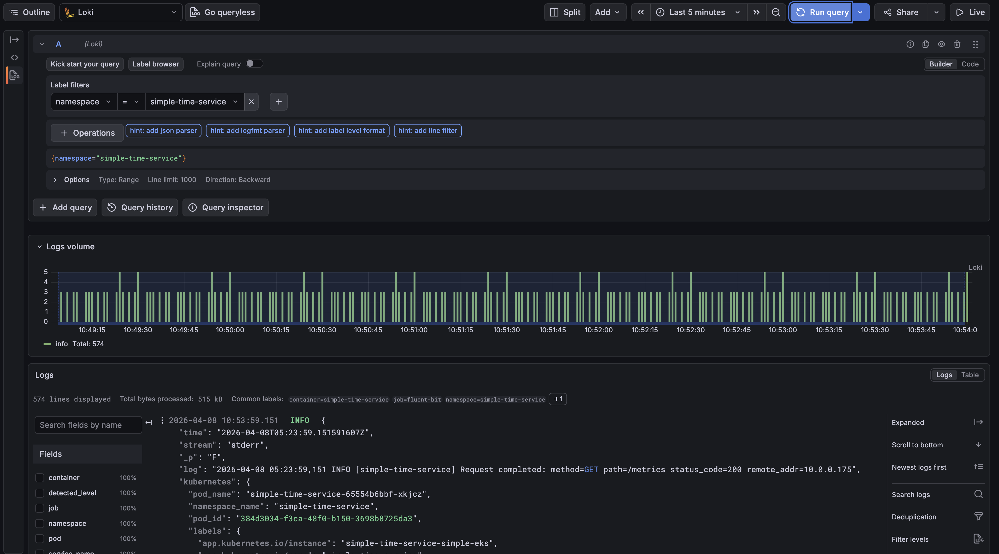

# GitOps Platform

This directory implements the **App of Apps** pattern with ArgoCD. A single root Application bootstraps ArgoCD, which then discovers and reconciles all other applications declared in the repo.


```
gitops/
├── bootstrap/
│   └── root-app.yaml                    # Root Application - syncs all manifests under gitops/
├── app/
│   └── simple-time-service.yaml         # ApplicationSet - deploys Helm chart to each registered cluster
├── prometheus/
│   └── prometheus.yaml                  # ApplicationSet - kube-prometheus-stack
├── metrics-server/
│   └── metrics-server.yaml              # ApplicationSet - metrics-server (required for HPA)
├── grafana/
│   └── simple-time-service-dashboard.yaml  # ApplicationSet - Grafana dashboard via charts/raw
├── alerts/
│   ├── simple-time-service-alerts.yaml  # ApplicationSet - PrometheusRule (alert expressions)
│   └── alertmanager-slack.yaml          # ApplicationSet - AlertmanagerConfig (Slack routing)
├── loki/
│   ├── loki.yaml                        # ApplicationSet - Loki single-binary log store
│   └── grafana-loki-datasource.yaml     # ApplicationSet - Grafana Loki datasource via charts/raw
└── fluent-bit/
    └── fluent-bit.yaml                  # ApplicationSet - Fluent Bit DaemonSet (log collector → Loki)
```

---

## Prerequisites

| Tool | Purpose |
|------|---------|
| `kubectl` configured against the EKS cluster | Deploy and manage ArgoCD |
| `argocd` CLI (optional) | Interact with ArgoCD from the terminal |

---

## Installing ArgoCD

```bash
kubectl create namespace argocd

kubectl apply -n argocd \
  -f https://raw.githubusercontent.com/argoproj/argo-cd/stable/manifests/install.yaml

kubectl wait --for=condition=available --timeout=300s \
  deployment/argocd-server -n argocd
```

### Retrieve the initial admin password

```bash
kubectl -n argocd get secret argocd-initial-admin-secret \
  -o jsonpath="{.data.password}" | base64 -d; echo
```

---

## Bootstrap - deploy the root Application

Apply the root app manifest once. This is the only manual deployment step:

```bash
kubectl apply -f gitops/bootstrap/root-app.yaml
```

ArgoCD begins reconciling the `gitops/` directory. Within the default polling interval (up to 3 minutes) it discovers all ApplicationSets and provisions every platform component.

---

## Accessing ArgoCD

```bash
kubectl port-forward svc/argocd-server -n argocd 8080:443
```

Open [https://localhost:8080](https://localhost:8080). Log in with `admin` and the password retrieved above.

### Sync via the ArgoCD CLI

```bash
argocd login localhost:8080 \
  --username admin \
  --password <password> \
  --insecure

argocd app sync root-app
argocd app sync simple-time-service-in-cluster
argocd app get simple-time-service-in-cluster
```

---

## Sync policy

The root Application is configured with **automated sync, pruning, and self-healing**:

```yaml
syncPolicy:
  automated:
    prune: true
    selfHeal: true
```

Any `git push` to `main` affecting `gitops/` or `charts/` is automatically applied within the ArgoCD polling interval (3 minutes). Manual syncs via the UI or CLI take effect immediately.

---

## Application inventory

| App | File | What it deploys |
|-----|------|-----------------|
| Root | `bootstrap/root-app.yaml` | Discovers all other apps in `gitops/` |
| simple-time-service | `app/simple-time-service.yaml` | SimpleTimeService Helm chart with HPA enabled |
| prometheus | `prometheus/prometheus.yaml` | kube-prometheus-stack (Prometheus + Grafana + Alertmanager) |
| metrics-server | `metrics-server/metrics-server.yaml` | metrics-server into `kube-system` |
| grafana-dashboard | `grafana/simple-time-service-dashboard.yaml` | Grafana dashboard ConfigMap via `charts/raw` |
| simple-time-service-alerts | `alerts/simple-time-service-alerts.yaml` | PrometheusRule CRD |
| alertmanager-slack | `alerts/alertmanager-slack.yaml` | AlertmanagerConfig CRD for Slack routing |
| loki | `loki/loki.yaml` | Loki single-binary log store |
| grafana-loki-datasource | `loki/grafana-loki-datasource.yaml` | Loki datasource ConfigMap for Grafana |
| fluent-bit | `fluent-bit/fluent-bit.yaml` | Fluent Bit DaemonSet (log collector) |

---

## Autoscaling - HPA and metrics-server

### metrics-server

`metrics-server` aggregates CPU and memory usage from the Kubelets and exposes them via the Kubernetes Metrics API. It is a hard prerequisite for HPA to function.

Two flags are set to make it work correctly on EKS:

| Flag | Reason |
|------|--------|
| `--kubelet-preferred-address-types=InternalIP` | EKS node hostnames are not resolvable inside the cluster |
| `--kubelet-insecure-tls` | Skips kubelet TLS verification - acceptable for demos |

Verify:

```bash
kubectl top pods -n simple-time-service
kubectl top nodes
```

### HorizontalPodAutoscaler

The HPA is **disabled by default** in `values.yaml` and enabled via a Helm value override in `gitops/app/simple-time-service.yaml`:

```yaml
hpa:
  enabled: true
```

When enabled, the HPA targets 70% average CPU utilization and scales between 2 and 10 replicas. Scale-up is fast (add 2 pods every 30s, no delay); scale-down is conservative (remove 1 pod/minute after 5 minutes of sustained low load).

Verify the HPA:

```bash
kubectl get hpa -n simple-time-service
```

---

## Network Policy

Network Policy enforcement is **disabled by default**. Enabling it is a two-step process.

### Step 1 - Enable the Network Policy controller in Terraform

Open [terraform/modules/eks/main.tf](../terraform/modules/eks/main.tf) and uncomment the `configuration_values` block inside the `vpc-cni` add-on:

```hcl
vpc-cni = {
  before_compute = true
  most_recent    = true
  configuration_values = jsonencode({
    enableNetworkPolicy = "true"
  })
}
```

Then apply:

```bash
cd terraform && terraform apply
```

### Step 2 - Enable the NetworkPolicy resource in the ApplicationSet

Open [gitops/app/simple-time-service.yaml](app/simple-time-service.yaml) and set `networkPolicy.enabled` to `true`:

```yaml
helm:
  values: |
    networkPolicy:
      enabled: true
```

Commit and push to `main`. ArgoCD will deploy the `NetworkPolicy` resource within the polling interval.

### What the NetworkPolicy allows

| Direction | Allowed | Reason |
|-----------|---------|--------|
| Ingress | Port 8080 from same namespace | Pod-to-pod traffic |
| Ingress | Port 8080 from `monitoring` namespace | Prometheus scraping |
| Egress | Port 53 UDP/TCP | DNS resolution |
| Everything else | Denied | The app makes no outbound calls |

Verify:

```bash
kubectl get networkpolicy -n simple-time-service
```

---

## Monitoring - Prometheus, Grafana, and Alertmanager

The `gitops/prometheus/prometheus.yaml` ApplicationSet deploys the [`kube-prometheus-stack`](https://github.com/prometheus-community/helm-charts/tree/main/charts/kube-prometheus-stack) to every cluster.

### What gets deployed

| Component | Details |
|-----------|---------|
| Prometheus | Metrics collection with a 7-day retention window |
| Grafana | Dashboards UI, auto-provisioned with Prometheus and Loki datasources |
| Alertmanager | Alert routing and grouping |
| Prometheus Operator | Manages `PrometheusRule` and `ServiceMonitor` CRDs |

All components are installed into the `monitoring` namespace.

### Key configuration

`serviceMonitorSelectorNilUsesHelmValues: false` tells Prometheus to discover `ServiceMonitor` resources across **all namespaces**. Without this, `ServiceMonitor` resources in `simple-time-service` are silently ignored.

TLS and admission webhooks on the operator are disabled to simplify bootstrap. Enable them in production.

### Access Grafana

```bash
kubectl port-forward svc/prometheus-grafana -n monitoring 3000:80
```

Open [http://localhost:3000](http://localhost:3000). Default username: `admin`. If the password is unknown:

```bash
kubectl get secret prometheus-grafana -n monitoring \
  -o jsonpath="{.data.admin-password}" | base64 -d; echo
```

### Access Prometheus

```bash
kubectl port-forward svc/prometheus-kube-prometheus-prometheus -n monitoring 9090:9090
```

### SimpleTimeService Grafana dashboard


A pre-built dashboard is automatically provisioned via `gitops/grafana/simple-time-service-dashboard.yaml`. It deploys a ConfigMap with label `grafana_dashboard: "1"` into the `monitoring` namespace - Grafana's sidecar imports it automatically.

The dashboard (UID `simple-time-service`, auto-refreshes every 30 seconds) contains 12 panels across 5 rows: status overview, traffic, request activity, CPU, and memory.

> HTTP traffic panels show **No data** until the ServiceMonitor is enabled and the service has received non-health-check traffic.

### Verify the ServiceMonitor

```bash
# Confirm the ServiceMonitor resource exists
kubectl get servicemonitor -n simple-time-service

# Check Prometheus has picked it up (open http://localhost:9090/targets)
kubectl port-forward svc/prometheus-kube-prometheus-prometheus -n monitoring 9090:9090

# Query a metric
# In Prometheus UI: http_requests_total
```

---

## Alerting

Alerting is split across two ArgoCD apps in `gitops/alerts/`:

| App | File | Purpose |
|-----|------|---------|
| `simple-time-service-alerts` | `simple-time-service-alerts.yaml` | Deploys the `PrometheusRule` CRD with alert expressions |
| `alertmanager-slack` | `alertmanager-slack.yaml` | Deploys the `AlertmanagerConfig` CRD for Slack routing |

### PrometheusRules

| Alert | Condition | Severity |
|-------|-----------|----------|
| `SimpleTimeServiceDown` | Scrape target unreachable for 1m | critical |
| `SimpleTimeServiceHPAAtMaxReplicas` | HPA at max replicas (10) for 5m | warning |

The `PrometheusRule` carries the label `notify: slack`. Any future alert added to the same rule automatically routes to Slack.

### Enabling Slack notifications

```bash
cp secrets/alertmanager-config.example.yaml secrets/slack-webhook-url.yaml
# Edit secrets/slack-webhook-url.yaml and paste your Slack webhook URL
kubectl apply -f secrets/slack-webhook-url.yaml -n monitoring
argocd app sync alertmanager-slack-simple-eks
```

> `secrets/slack-webhook-url.yaml` is gitignored. Never commit it.

The stack deploys without the secret - only the `alertmanager-slack` app will show as degraded in ArgoCD.

### EKS false positives suppressed

`KubeSchedulerDown` and `KubeControllerManagerDown` are disabled in `prometheus.yaml`. On EKS these alerts would fire permanently since the control plane is not exposed for Prometheus scraping.

### Testing the Slack receiver

```bash
# 1. Port-forward Alertmanager
kubectl port-forward svc/prometheus-kube-prometheus-alertmanager -n monitoring 9093:9093

# 2. Fire a fake alert
curl -X POST http://localhost:9093/api/v2/alerts \
  -H 'Content-Type: application/json' \
  -d '[{
    "labels":      {"alertname":"TestAlert","severity":"critical","notify":"slack"},
    "annotations": {"summary":"Test alert","description":"Verifying Slack receiver works"}
  }]'
```

The alert appears in `#alerts-test` within 30 seconds and auto-resolves after 5 minutes.


<details>
<summary><strong>Operational notes - silencing, inhibition, and grouping</strong></summary>

### Silencing alerts

```bash
kubectl port-forward svc/prometheus-kube-prometheus-alertmanager -n monitoring 9093:9093
# Open http://localhost:9093 → Silences → New Silence
```

Via API:

```bash
NOW=$(date -u +"%Y-%m-%dT%H:%M:%SZ")
UNTIL=$(date -u -v+2H +"%Y-%m-%dT%H:%M:%SZ")  # macOS
# UNTIL=$(date -u -d '+2 hours' +"%Y-%m-%dT%H:%M:%SZ")  # Linux

curl -X POST http://localhost:9093/api/v2/silences \
  -H 'Content-Type: application/json' \
  -d "{
    \"matchers\": [{\"name\":\"notify\",\"value\":\"slack\",\"isRegex\":false}],
    \"startsAt\":  \"$NOW\",
    \"endsAt\":    \"$UNTIL\",
    \"comment\":   \"Maintenance window\",
    \"createdBy\": \"nabeem\"
  }"
```

### Grouping

| Setting | Value | Meaning |
|---------|-------|---------|
| `groupWait` | 30s | Wait 30s before sending the first notification |
| `groupInterval` | 5m | Wait 5m before notifying on an updated group |
| `repeatInterval` | 4h | Re-notify every 4h if still firing |

</details>

---

## Log Aggregation - Loki, Fluent Bit, and Grafana datasource

### Architecture

```
[Each node] Fluent Bit DaemonSet
    │  tails /var/log/containers/*.log
    │  enriches with Kubernetes labels
    ▼
loki-gateway.logging.svc.cluster.local
    ▼
Loki (SingleBinary, logging namespace)
    ▼
Grafana datasource (auto-provisioned ConfigMap)
    ▼
Grafana → Explore → Loki queries (LogQL)
```

### What gets deployed

| Component | Helm chart | Namespace | Sync wave |
|-----------|-----------|-----------|-----------|
| Loki | `grafana-community/loki` `6.56.1` | `logging` | 3 |
| Fluent Bit | `fluent/fluent-bit` `0.48.9` | `logging` | 4 |
| Grafana Loki datasource | `charts/raw` (ConfigMap) | `monitoring` | 4 |

### Loki configuration

Loki runs in `SingleBinary` mode with one replica.

> **Ephemeral storage:** Logs are stored on an `emptyDir` volume and are **permanently lost when the Loki pod restarts**. Replace with S3/GCS in any persistent environment.

| Setting | Value |
|---------|-------|
| Deployment mode | `SingleBinary` |
| Storage | `filesystem` (emptyDir) |
| Replication factor | `1` |
| Auth | disabled (`auth_enabled: false`) |

### Fluent Bit configuration

Fluent Bit runs as a DaemonSet (one pod per node). It tails `/var/log/containers/*.log`, enriches records with Kubernetes metadata, and forwards to Loki with these labels:

| Label | Value |
|-------|-------|
| `job` | `fluent-bit` |
| `namespace` | `$kubernetes['namespace_name']` |
| `pod` | `$kubernetes['pod_name']` |
| `container` | `$kubernetes['container_name']` |

### Querying logs in Grafana



```bash
kubectl port-forward svc/prometheus-grafana -n monitoring 3000:80
```

Open [http://localhost:3000](http://localhost:3000) → **Explore** → select **Loki** datasource. Example LogQL queries:

```logql
{namespace="simple-time-service"}
{namespace="simple-time-service", container="simple-time-service"}
{namespace="simple-time-service"} |= "ERROR"
```

### Verify Loki is receiving logs

```bash
kubectl get pods -n logging
kubectl port-forward svc/loki-gateway -n logging 3100:80
curl 'http://localhost:3100/loki/api/v1/labels'
```
