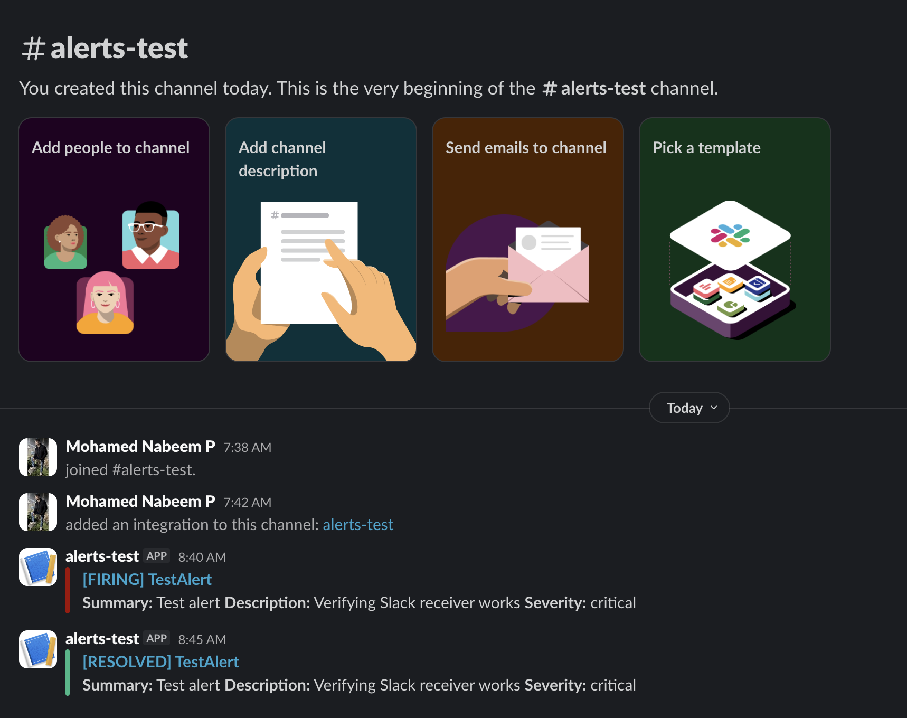

# Alerting - PrometheusRules and Slack

The `gitops/alerts/` directory deploys two ArgoCD apps that together form the alerting pipeline.

| File | What it deploys |
|------|----------------|
| `simple-time-service-alerts.yaml` | `PrometheusRule` CRD — alert expressions evaluated by Prometheus |
| `alertmanager-slack.yaml` | `AlertmanagerConfig` CRD — routes matching alerts to a Slack channel |

---

## Alert rules

| Alert | Condition | Severity |
|-------|-----------|----------|
| `SimpleTimeServiceDown` | Scrape target unreachable for 1 minute | critical |
| `SimpleTimeServiceHPAAtMaxReplicas` | HPA at max replicas (10) for 5 minutes | warning |

Both rules carry the label `notify: slack`. The Slack route matches on this label — any future alert added to the same `PrometheusRule` automatically routes to Slack without touching the route config.

---

## Enabling Slack notifications

The stack deploys without the Slack secret. Only the `alertmanager-slack` app shows as degraded in ArgoCD — Alertmanager itself runs fine on its default config.

```bash
# 1. Fill in your webhook URL
cp secrets/alertmanager-config.example.yaml secrets/slack-webhook-url.yaml
# Edit secrets/slack-webhook-url.yaml — paste your Slack incoming webhook URL

# 2. Apply the secret
kubectl apply -f secrets/slack-webhook-url.yaml -n monitoring

# 3. Sync the ArgoCD app
argocd app sync alertmanager-slack-simple-eks
```

> `secrets/slack-webhook-url.yaml` is gitignored. Never commit it.

---

## Testing the Slack receiver

Verify the full Alertmanager → Slack path without touching any cluster resources:

```bash
# 1. Port-forward Alertmanager
kubectl port-forward svc/prometheus-kube-prometheus-alertmanager -n monitoring 9093:9093

# 2. Fire a fake alert (in a second terminal)
curl -X POST http://localhost:9093/api/v2/alerts \
  -H 'Content-Type: application/json' \
  -d '[{
    "labels":      {"alertname":"TestAlert","severity":"critical","notify":"slack"},
    "annotations": {"summary":"Test alert","description":"Verifying Slack receiver works"}
  }]'
```

The alert appears in `#alerts-test` within 30 seconds and auto-resolves after 5 minutes.

> The `notify: slack` label is required — the route only matches alerts carrying it.



---

## Silencing alerts

**Via the Alertmanager UI:**

```bash
kubectl port-forward svc/prometheus-kube-prometheus-alertmanager -n monitoring 9093:9093
# Open http://localhost:9093 → Silences → New Silence
```

**Via the API:**

```bash
NOW=$(date -u +"%Y-%m-%dT%H:%M:%SZ")
UNTIL=$(date -u -v+2H +"%Y-%m-%dT%H:%M:%SZ")   # macOS
# UNTIL=$(date -u -d '+2 hours' +"%Y-%m-%dT%H:%M:%SZ")  # Linux

# Silence all notify=slack alerts for 2 hours
curl -X POST http://localhost:9093/api/v2/silences \
  -H 'Content-Type: application/json' \
  -d "{
    \"matchers\": [{\"name\":\"notify\",\"value\":\"slack\",\"isRegex\":false}],
    \"startsAt\":  \"$NOW\",
    \"endsAt\":    \"$UNTIL\",
    \"comment\":   \"Maintenance window\",
    \"createdBy\": \"nabeem\"
  }"

# Silence a specific alert by name
curl -X POST http://localhost:9093/api/v2/silences \
  -H 'Content-Type: application/json' \
  -d "{
    \"matchers\": [{\"name\":\"alertname\",\"value\":\"SimpleTimeServiceDown\",\"isRegex\":false}],
    \"startsAt\":  \"$NOW\",
    \"endsAt\":    \"$UNTIL\",
    \"comment\":   \"Known issue — investigating\",
    \"createdBy\": \"nabeem\"
  }"
```

Silences are stored in Alertmanager only — not persisted to git, lost on pod restart.

---

## Grouping and timing

Alerts with the same `alertname` + `namespace` are batched into a single Slack message.

| Setting | Value | Meaning |
|---------|-------|---------|
| `groupWait` | 30s | Wait before sending the first notification for a new group |
| `groupInterval` | 5m | Wait before re-notifying when an existing group changes |
| `repeatInterval` | 4h | Re-notify if the alert is still firing after this interval |

---

## How the routing works

The `AlertmanagerConfig` uses `alertmanagerConfigMatcherStrategy: None` so the route is not scoped to a single namespace — it matches alerts from anywhere in the cluster that carry `notify=slack`. Built-in EKS noise alerts (`KubeSchedulerDown`, `KubeControllerManagerDown`) are suppressed in `prometheus.yaml` since the EKS control plane is never exposed for scraping.
