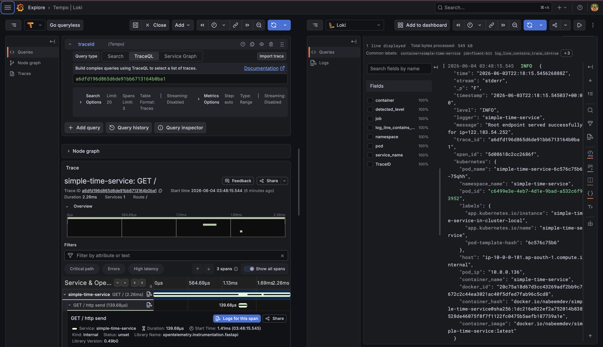

# Tracing - OTel Collector and Tempo

The `gitops/tracing/` directory deploys the full distributed tracing pipeline via ArgoCD.

| File | What it deploys |
|------|----------------|
| `tempo/tempo.yaml` | Grafana Tempo in monolithic mode - central trace store backed by S3 |
| `tempo/grafana-tempo-datasource.yaml` | Grafana Tempo datasource ConfigMap with Loki trace-to-log correlation, auto-provisioned via `charts/raw` |
| `otel-collector/otel-collector-gateway.yaml` | OTel Collector Deployment - central gateway that receives spans from all agents, batches, and exports to Tempo |
| `otel-collector/otel-collector-agent.yaml` | OTel Collector DaemonSet - node-local agent that receives spans from co-located pods and forwards to the gateway |

---

## Architecture

```
Pod (simple-time-service)
  │  OTLP HTTP → status.hostIP:4318  (node-local, no cross-node hop)
  ▼
OTel Agent  (DaemonSet · one pod per node · hostPort 4318)
  │  OTLP gRPC → otel-gateway.tracing.svc.cluster.local:4317
  ▼
OTel Gateway  (Deployment · tracing namespace · batch 1 s / 1 000 spans)
  │  OTLP gRPC → tempo.tracing.svc.cluster.local:4317
  ▼
Tempo  (Deployment · tracing namespace)
  │  writes trace blocks to S3 via IRSA · 30-day retention
  ▼
S3 bucket: <cluster-name>-tempo-traces-<account-id>-<region>

Grafana ◀── Tempo datasource (query port :3100)
              tracesToLogsV2 ──▶ Loki (uid: loki)
```

The two-tier collector topology keeps inter-node traffic off the path for every span write. Pods send to `$(status.hostIP):4318` - always the local agent - so the only cross-node traffic is the agent-to-gateway leg, which is batched.

Sync-wave ordering ensures the gateway is healthy before the agent tries to forward to it, and both are ready before the application workload starts emitting spans:

| Component | Sync wave | Reason |
|-----------|-----------|--------|
| Tempo | 6 | Storage backend before any span is accepted |
| OTel Gateway | 6 | Accepts from agents; must exist before agents start |
| OTel Agent | 7 | Forwards to gateway; deploying after guarantees the endpoint resolves |
| Grafana Tempo datasource | 8 | After Grafana (wave 7) and after Loki datasource (wave 8) |

---

## OTel Collector Gateway

Runs as a single-replica **Deployment** in the `tracing` namespace. Tolerates `app=core:NoSchedule` so it lands on a managed node group node alongside the other platform services.

| Setting | Value |
|---------|-------|
| Mode | `deployment` |
| Receivers | OTLP gRPC `:4317`, OTLP HTTP `:4318` |
| Processors | `memory_limiter` (256 MiB) → `batch` (1 s / 1 000 spans) |
| Exporter | OTLP gRPC → `tempo.tracing.svc.cluster.local:4317` (insecure, in-cluster) |
| Resources | 100m / 256Mi request · 500m / 512Mi limit |
| Service name | `otel-gateway` (via `fullnameOverride`) |

The `memory_limiter` runs before `batch` so backpressure propagates upstream before the process OOMs.

---

## OTel Collector Agent

Runs as a **DaemonSet** in the `tracing` namespace - one pod per node. Tolerates all `NoSchedule` taints so it runs on both managed core nodes and Karpenter workload nodes.

| Setting | Value |
|---------|-------|
| Mode | `daemonset` |
| Receiver | OTLP HTTP `:4318` (also exposed as `hostPort: 4318`) |
| Processors | `memory_limiter` (128 MiB) → `batch` (200 ms / 128 spans) |
| Exporter | OTLP gRPC → `otel-gateway.tracing.svc.cluster.local:4317` (insecure, in-cluster) |
| Resources | 50m / 128Mi request · 200m / 256Mi limit |
| Service name | `otel-agent` (via `fullnameOverride`) |

The `hostPort: 4318` binding is what makes `http://$(NODE_IP):4318` work from application pods. The Helm chart for `simple-time-service` injects `NODE_IP` via the downward API (`status.hostIP`) and constructs the endpoint automatically when `tracing.enabled: true`.

---

## Tempo

Runs in **monolithic mode** (single-process, all components) in the `tracing` namespace.

| Setting | Value | Notes |
|---------|-------|-------|
| Mode | Monolithic | All components in one process - suitable for demos |
| Storage | S3 (`backend: s3`) | Trace blocks written durably to S3 |
| Retention | 30 days (`retention: 720h`) | Configurable in `tempo/tempo.yaml` |
| IRSA | `<cluster-name>-tempo-irsa` | Grants scoped S3 read/write; no static credentials |
| Bucket | `<cluster-name>-tempo-traces-<account-id>-<region>` | Provisioned by `terraform/tempo.tf` |
| OTLP gRPC | `:4317` | Receives spans from the OTel gateway |
| Query API | `:3100` | Used by the Grafana datasource |

---

## Grafana Tempo datasource

A ConfigMap with label `grafana_datasource: "1"` deployed into the `monitoring` namespace. Grafana's sidecar detects it and provisions the datasource automatically - no manual steps needed.

| Setting | Value |
|---------|-------|
| Name | `Tempo` |
| UID | `tempo` |
| URL | `http://tempo.tracing.svc.cluster.local:3100` |
| Node graph | Enabled |
| `tracesToLogsV2.datasourceUid` | `loki` - clicking a span opens the correlated Loki log stream |
| `lokiSearch.datasourceUid` | `loki` - enables the **Logs** tab in the Tempo explorer |
| `serviceMap.datasourceUid` | `thanos` - service graph overlay from Prometheus metrics |

The Loki datasource is given `uid: loki` in `gitops/logs/loki/grafana-loki-datasource.yaml` so the reference above resolves correctly.

Correlation is **bidirectional**:

| Direction | Mechanism | How |
|-----------|-----------|-----|
| Trace → Logs | `tracesToLogsV2` in Tempo datasource | Open a trace → **Logs** tab → Grafana runs `{job=~".+"} \| json \| trace_id = "<id>"` against Loki |
| Log → Trace | `derivedFields` in Loki datasource | A log line with `"trace_id":"..."` gets a clickable **TraceID** link that opens the span in Tempo |

`derivedFields` applies a regex to each log line. Non-JSON lines that don't match are displayed unchanged - no errors, no broken layout.



---

## Instrumenting an application

The `simple-time-service` Helm chart handles all OTel wiring. Enable tracing in `gitops/app/simple-time-service/simple-time-service.yaml`:

```yaml
tracing:
  enabled: true
  serviceName: simple-time-service   # appears in Tempo search
```

The chart injects three env vars into the pod:

```yaml
env:
  - name: NODE_IP
    valueFrom:
      fieldRef:
        fieldPath: status.hostIP
  - name: OTEL_EXPORTER_OTLP_ENDPOINT
    value: http://$(NODE_IP):4318     # always the local agent
  - name: OTEL_SERVICE_NAME
    value: simple-time-service
```

The app (`app/src/app.py`) uses `opentelemetry-instrumentation-fastapi` to auto-instrument all HTTP routes and `JSONFormatter` to inject `trace_id` and `span_id` into every log line when a span is active.

For a new service, mirror this pattern: enable the OTel SDK with `OTEL_EXPORTER_OTLP_ENDPOINT` set to the node-local agent and `OTEL_SERVICE_NAME` set to something meaningful.

---

## Querying traces in Grafana

```bash
kubectl port-forward svc/prometheus-grafana -n monitoring 3000:80
```

Open [http://localhost:3000](http://localhost:3000) → **Explore** → select **Tempo** datasource.

**Search by service:**
- Tab: **Search**
- Service Name: `simple-time-service`
- Click any trace → span waterfall

**Search by trace ID** (from a JSON log line in Loki):

1. Explore → **Loki** → `{namespace="simple-time-service"}`
2. Find a log line with `"trace_id": "..."` and click the **Tempo** link that appears in the derived fields panel

**From Grafana Explore (split view):**

Use the split-pane view to open Loki and Tempo side-by-side. Clicking a trace ID in the Loki panel opens the matching Tempo trace in the right pane.

---

## Verifying the pipeline

```bash
# All tracing pods healthy
kubectl get pods -n tracing

# Agent is running on every node
kubectl get pods -n tracing -l app.kubernetes.io/name=opentelemetry-collector \
  -o wide

# Gateway is ready
kubectl rollout status deploy/otel-gateway -n tracing

# Tempo is ready
kubectl rollout status deploy/tempo -n tracing

# Send a test span to the local agent from outside the cluster (replace NODE_IP)
NODE_IP=$(kubectl get nodes -o jsonpath='{.items[0].status.addresses[?(@.type=="InternalIP")].address}')
kubectl run otlp-test --rm -it --image=curlimages/curl --restart=Never -- \
  curl -s -X POST "http://${NODE_IP}:4318/v1/traces" \
  -H "Content-Type: application/json" \
  -d '{"resourceSpans":[]}'

# Check Tempo received spans
kubectl port-forward svc/tempo -n tracing 3100:3100
curl http://localhost:3100/ready
```
